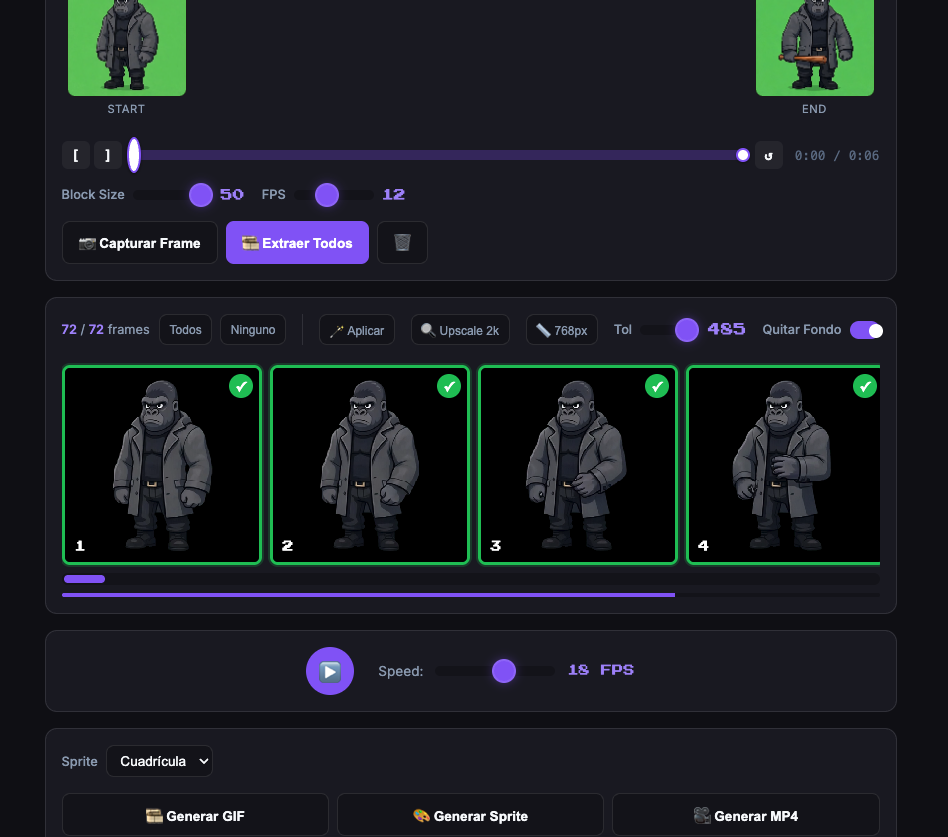
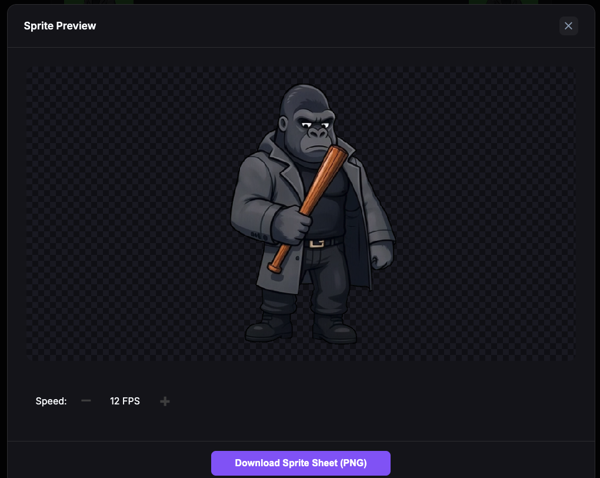

# Video to Pixel Art Converter

Una aplicación web potente y fácil de usar para convertir videos e imágenes en Pixel Art de alta calidad. Utiliza Inteligencia Artificial local para eliminar fondos y ofrece herramientas avanzadas de edición y exportación.

## 🚀 Características Principales

*   **Conversión de Video a Pixel Art**: Extrae frames de videos y conviértelos en sprites pixelados.
*   **Eliminación de Fondo con IA Local**: Utiliza el modelo **BiRefNet** ejecutándose localmente para eliminar el fondo de las imágenes con alta precisión, sin necesidad de conexión a internet ni APIs externas.
*   **Soporte de Aceleración por Hardware**: Detecta automáticamente y utiliza **MPS (Apple Silicon)** o **CUDA (NVIDIA)** para un procesamiento rápido.
*   **Edición en Tiempo Real**: Ajusta el tamaño de píxel (Block Size), paletas de colores, y saturación.
*   **Múltiples Formatos de Exportación**:
    *   **GIF Animado**: Crea animaciones pixel art fluidas.
    *   **Sprite Sheet**: Genera hojas de sprites para desarrollo de videojuegos.
    *   **MP4**: Exporta tu animación como video.
*   **Interfaz Intuitiva**: Arrastra y suelta archivos, visualiza frames y gestiona tu proyecto fácilmente.

## 🛠️ Requisitos del Sistema

*   **Python 3.8+** instalado en el sistema.
*   Navegador web moderno (Chrome, Firefox, Safari).
*   Recomendado: Mac con Apple Silicon (M1/M2/M3) o PC con GPU NVIDIA para mayor velocidad en la IA.

## 📦 Instalación y Uso

La aplicación está diseñada para ser "Plug & Play" utilizando el script de automatización incluido.

### En macOS / Linux

1.  Abre la terminal en la carpeta del proyecto (o simplemente haz doble clic en el archivo si tu sistema lo permite).
2.  Ejecuta el archivo `run_app.command`:
    ```bash
    ./run_app.command
    ```
    *Este script automáticamente:*
    *   Creará un entorno virtual de Python (`.venv`) si no existe.
    *   Instalará todas las dependencias necesarias (`requirements.txt`).
    *   Iniciará el servidor backend local en el puerto 8000.
    *   Abrirá automáticamente la aplicación en tu navegador predeterminado.

### Instalación Manual

Si prefieres hacerlo manualmente:

1.  Crea un entorno virtual: `python3 -m venv .venv`
2.  Actívalo: `source .venv/bin/activate` (Mac/Linux) o `.venv\Scripts\activate` (Windows).
3.  Instala dependencias: `pip install -r requirements.txt`
4.  Ejecuta el servidor: `python3 backend.py`
5.  Abre `http://localhost:8000` en tu navegador.

## 🧠 ¿Cómo Funciona?

El proyecto consta de dos partes principales:

1.  **Frontend (Interfaz Web)**:
    *   Construido con HTML, CSS y JavaScript vainilla.
    *   Maneja la carga de archivos, la lógica de pixelado (reducción de resolución y cuantización de colores) y la generación de archivos de exportación (GIF, MP4, Sprite Sheet).
    *   Se comunica con el backend únicamente para la tarea pesada de eliminar el fondo.

2.  **Backend (Python/Flask)**:
    *   Servidor ligero utilizando **Flask**.
    *   Carga el modelo de IA **BiRefNet** utilizando `transformers` y `torch`.
    *   Expone un endpoint `/remove-bg` que recibe una imagen, la procesa con la IA para obtener la máscara de transparencia, limpia los bordes (corrección de halos) y devuelve la imagen procesada en formato PNG.

## 📂 Estructura del Proyecto

*   `app.js`: Lógica principal del frontend.
*   `backend.py`: Servidor Flask y lógica de IA.
*   `styles.css`: Estilos de la interfaz.
*   `index.html`: Estructura de la página web.
*   `requirements.txt`: Lista de librerías de Python necesarias.
*   `run_app.command`: Script de inicio rápido.
*   `model_birefnet/`: Carpeta donde se almacena el modelo de IA localmente.

## 📝 Notas

*   La primera vez que ejecutes la aplicación, el modelo de IA se descargará automáticamente, lo cual puede tardar unos minutos dependiendo de tu conexión. Las siguientes ejecuciones serán mucho más rápidas.

## Screenshots




